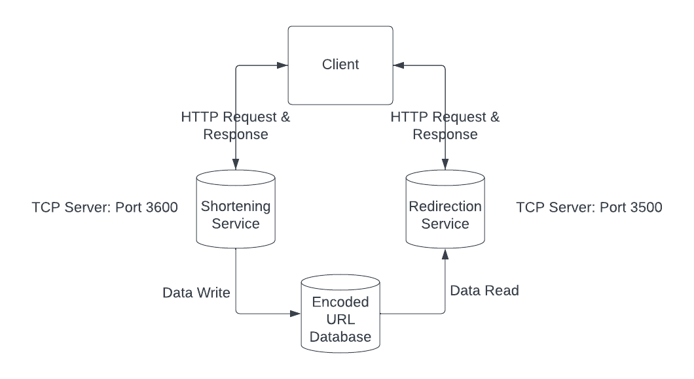

### URL-SHORTENER
A simple url-shortener which can do the following functions:
1. Shortening Request: Given an input URL, return the encoded shortened URL
2. Redirection Request: Given the shortened hash, decode the hash and redirect the client to the original URL if it exists.

#### Tentative Architecture

#### Pending
Tasks and some extra features which I may implement totally depending on my mood ~~and procrastination~~ ¯\\\_(ツ)_/¯  
1. HTTP Request Extraction Service
2. HTTP Response Formulation Service
3. Shortening & Redirection Service TCP Server
4. URL-Shortening Encoding Algorithms (Handling Collisions)
5. Incorporating a non-persistent database (Maybe)
6. Handling multiple clients and ensuring consistency (multithreading)
7. Migration to a persistent database
8. Incorporating a cache and implementing the eviction policy (Maybe)
9. Handling TTL and expiry of shortened URLs (Maybe)